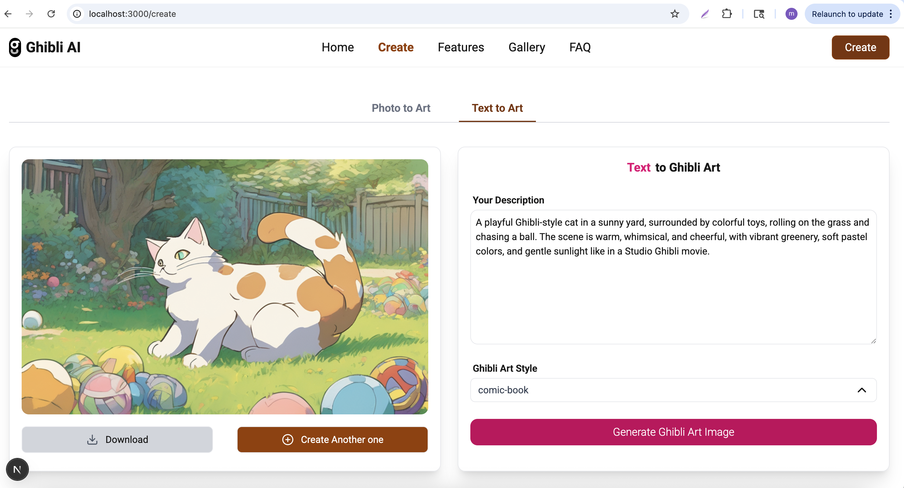

This is a Next.js project with Springboot as backend based on Bushan project at youtube video:(https://www.youtube.com/watch?v=VTPyi6c4Vp8).

---

### Note: for uploading image size 
- Stability AI (https://platform.stability.ai/docs/api-reference#tag/SDXL-1.0), Version 1 for stable-diffusion-xl-1024-v0-9 and stable-diffusion-xl-1024-v1-0 the allowed dimensions are 1024x1024, 1152x896, 1216x832, 1344x768, 1536x640, 640x1536, 768x1344, 832x1216, 896x1152

### Tech stack
- Stability AI to generate ghibli style art

### .env setup
- API_URL_TEXT=backend url of generate-from-text
- API_URL_IMAGE=backend url of generate-from-image

---
## Screen shot of project result

